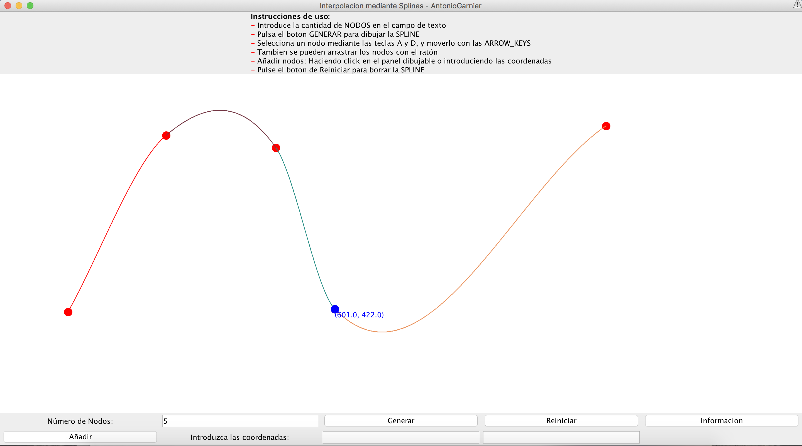

# Interpolacion mediante Spline

En el subcampo matemático del análisis numérico, un spline es una curva diferenciable definida en porciones mediante polinomios.

En los problemas de interpolación, se utiliza a menudo la interpolación mediante splines porque da lugar a resultados similares requiriendo solamente el uso de polinomios de bajo grado, evitando así las oscilaciones, indeseables en la mayoría de las aplicaciones, encontradas al interpolar mediante polinomios de grado elevado.

Para el ajuste de curvas, los splines se utilizan para aproximar formas complicadas. La simplicidad de la representación y la facilidad de cómputo de los splines los hacen populares para la representación de curvas en informática, particularmente en el terreno de los gráficos por ordenador. [Fuente Wikipedia](https://es.wikipedia.org/wiki/Spline).

   

## [Guía para visualizar la Applet](https://github.com/AntonioGarnier/Applets)

## [Enlace a la gh-pages](https://antoniogarnier.github.io/InterpolacionSpline/)
